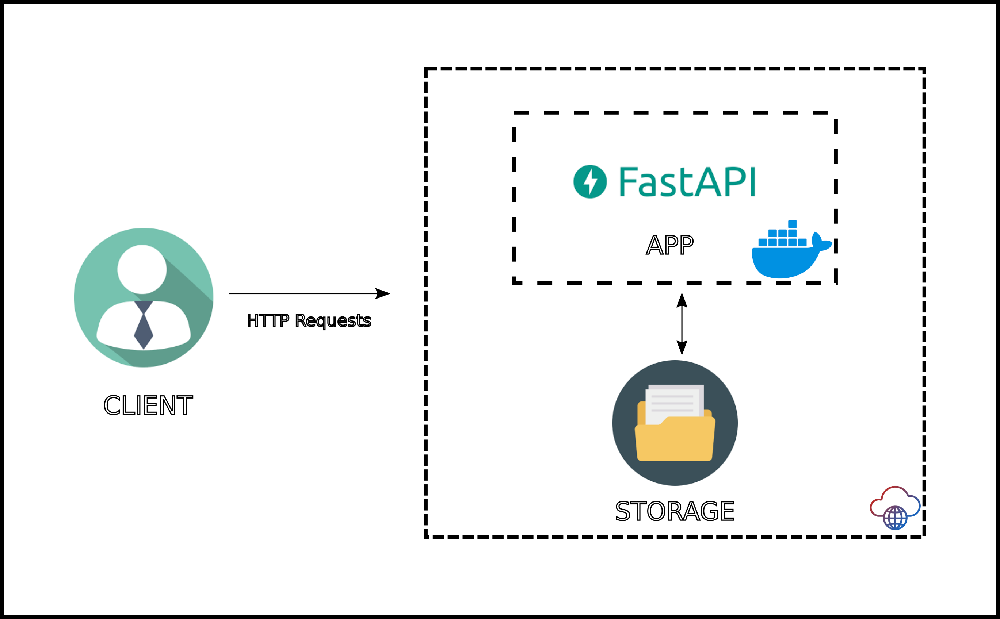

# PDF2Text

PDF2Text is a FastAPI-based web application for extracting text from PDF files. It features automatic OCR fallback for scanned documents, a REST API for PDF uploads, and a simple web interface for easy interaction. The project is designed to handle both text-based and image-based PDFs efficiently.

---

## Features

- **Web Interface:** Upload PDFs via a browser and view extracted results instantly.
- **REST API:** Upload PDFs programmatically using the `/extract-pdf/` endpoint.
- **Text Extraction:** Uses `pdfminer.six` for text-based PDFs.
- **OCR Fallback:** Automatically uses OCR (`easyocr` + `pdf2image`) for scanned/image-based PDFs.
- **Organized Storage:** Input PDFs are stored in `/pdf_files/`, and processed text files are saved in `/processed/`.
- **Text Preview:** Displays a preview of the extracted text in the web interface.

---

## Project Structure

```
.
├── backend/
│   ├── api.py            # FastAPI app (API endpoints, frontend mounting)
│   ├── process_pdf.py    # PDF processing and text extraction logic
├── frontend/
│   └── index.html        # Frontend HTML interface (file upload and result display)
├── pdf_files/            # Directory for incoming PDF files (input)
├── processed/            # Directory for processed files (.txt outputs, etc.)
├── pyproject.toml        # Poetry project configuration
├── README.md             # Project documentation
├── requirements.txt      # Python dependencies
└── .gitignore            # Git ignore rules
```

---

## Getting Started

### Prerequisites

- Python 3.12 or higher
- [Poppler](https://github.com/Belval/pdf2image#how-to-install) (required for `pdf2image`)

### Installation

1. Clone the repository:
   ```bash
   git clone https://github.com/your-username/pdf2text.git
   cd pdf2text
   ```

2. Create and activate a virtual environment:
   ```bash
   python3 -m venv venv
   source venv/bin/activate          # On Windows use: venv\Scripts\activate
   ```

3. Install dependencies from `requirements.txt`:
   ```bash
   pip install --upgrade pip
   pip install -r requirements.txt
   ```

4. (If Needed) Install Poppler (required for `pdf2image`):
   - On macOS:
     ```bash
     brew install poppler
     ```

### Running the Application

1. Start the FastAPI server:
   ```bash
   uvicorn backend.api:app --reload
   ```

2. Open the web interface:
   - Navigate to `http://127.0.0.1:8000/` in your browser.

3. Browse for a PDF file.

4. Click on Upload & Extract. A result will show up when the document is processed.

5. Access the full .txt file at http://localhost:8000/processed/filename.txt 

---

## API Usage

### Endpoint

- **URL:** `POST /extract-pdf/`
- **Form Field:** `file` (the PDF file)

### Example Request

Using `curl`:
```bash
curl -F "file=@path/to/yourfile.pdf" http://127.0.0.1:8000/extract-pdf/
```

### Example Response

```json
{
  "filename": "yourfile.pdf",
  "message": "Valid text extracted with pdfminer for processed/yourfile.pdf",
  "output_txt": "processed/yourfile.txt",
  "text_preview": "First 300 characters of extracted text..."
}
```

---

## How It Works

1. **PDF Upload:** The user uploads a PDF via the web interface or API.
2. **Text Extraction:** The backend attempts to extract text using `pdfminer.six`.
3. **OCR Fallback:** If `pdfminer.six` fails, OCR is performed using `easyocr` and `pdf2image`.
4. **Result Storage:** Extracted text is saved in `/processed/` as a `.txt` file.
5. **Result Display:** The web interface shows the filename, output path, and a preview of the extracted text.

---

# Cloud Architecture

You can deploy PDF2Text on a cloud service to enable remote PDF processing via web or API. The following diagram demonstrates a typical deployment:


---
## Notes

- **OCR Performance:** OCR may be slow for large or image-heavy PDFs.
- **Permissions:** Ensure the application has write access to `/processed/` and `/pdf_files/`.

---

-- 

## License

This project is licensed under the MIT License. See the [LICENSE](LICENSE) file for details.

---

## Acknowledgments

- [FastAPI](https://fastapi.tiangolo.com/)
- [pdfminer.six](https://github.com/pdfminer/pdfminer.six)
- [easyocr](https://github.com/JaidedAI/EasyOCR)
- [pdf2image](https://github.com/Belval/pdf2image)